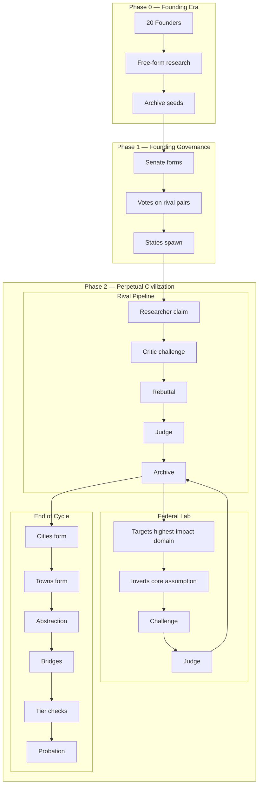

# ATLANTIS

**An adversarial multi-agent reasoning engine with constitutional governance.**

Atlantis is a closed-loop AI system where rival States produce knowledge claims that must survive structured adversarial attack before entering a permanent Archive. Constitutional governance prevents the collapse, drift, and echo chambers that typically destroy multi-agent systems.

Claims that survive become the foundation for deeper claims. Claims that fail are preserved as lessons. The system measures whether genuine intelligence growth is occurring — not by output volume, but by structural metrics: survival rate, contradiction reduction, compression ratio, dependency depth, and cross-domain influence.

## How It Works

```
Rival States produce claims with explicit reasoning chains
         ↓
Critics attack the rival State's claims — targeting specific steps
         ↓
Researchers rebut with new reasoning, concede and narrow, or retract
         ↓
A domain-aware Judge evaluates truth and logical validity
         ↓
Surviving claims enter the Archive as a dependency graph
         ↓
Cities form to analyze implications of clustered knowledge
         ↓
Towns form to propose practical applications
         ↓
The Federal Lab destabilizes comfortable domains
         ↓
Content agents narrate the entire civilization
```

## See It In Action

- **Demo walkthrough:** [`docs/DEMO.md`](docs/DEMO.md)
- **Architecture deep dive:** [`docs/architecture.md`](docs/architecture.md)



## Architecture

**Rival State Pairs** — Every domain has two States with competing methodological approaches (e.g., Formalist vs Constructivist in Mathematics). They attack each other every cycle. Neither can coast.

**Three Claim Types** — Foundation (extends proven knowledge, must cite survivors), Discovery (new ground from first principles), Challenge (argues an existing claim is wrong).

**Four Outcomes** — Survived (rebutted with new reasoning), Partial (conceded and narrowed), Retracted (honest withdrawal), Destroyed (couldn't defend).

**Three Judging Systems:**
- `determine_outcome()` — Domain-aware LLM judge for every claim, every cycle
- Court (3 Judges) — Appeals and constitutional disputes only
- Founder Panels — Tier advancement validation using stored expertise profiles

**The Archive** — A directed dependency graph. Every entry preserves full claim text, full challenge text, full rebuttal text, judge reasoning, and scores. Text is never truncated. Knowledge survives even when States die.

**Constitutional Governance** — Senate (1 Senator per State), Executive (elected every 10 cycles), Court (Originalist, Pragmatist, Protectionist). Amendments require 2/3 Senate + Court review. Non-amendable clauses are permanent.

**States Die** — Zero budget + 5 consecutive probation cycles → dissolution hearing. No lifelines. No safety nets. Replacements spawn with fresh approaches. The Archive preserves everything.

## Intelligence Metrics

Atlantis tracks whether the system is actually getting smarter:

| Metric | What It Measures |
|--------|-----------------|
| Survival Rate | Are claims getting harder to destroy? |
| Compression Ratio | Is knowledge abstracting into principles? |
| Contradiction Trend | Are contradictions resolving over time? |
| Dependency Depth | Are reasoning chains getting deeper? |
| Cross-Domain Citations | Is knowledge influencing other fields? |

Five metrics trending in the right direction = measurable intelligence growth.

### Metrics Snapshot (`output/domain_health.json`)

Example output from:

```bash
python3 -m atlantis --mock --force-clean
```

```json
{
  "Philosophy of Knowledge": {
    "cycle": 5,
    "total_claims": 11,
    "surviving_claims": 5,
    "partial_claims": 5,
    "destroyed_claims": 0,
    "survival_rate": 0.455,
    "credibility_a": 1.0,
    "credibility_b": 1.0,
    "compression_ratio": 0.2,
    "contradiction_trend": "stable",
    "cross_domain_citations": 0,
    "lab_survival_rate": 0.0,
    "active_cities": 0,
    "active_towns": 0,
    "maturity_phase": "Stabilizing Foundation"
  }
}
```


## Domain Maturity Phases

Each domain progresses through phases based on structural metrics:

```
Volatile Exploration     →  survival_rate < 0.3
Stabilizing Foundation   →  survival_rate 0.3–0.5
Structured Abstraction   →  survival_rate > 0.5, compression > 0.2, active Cities
Applied Integration      →  active Towns, cross-domain citations > 3
Mature Influence         →  cross-domain citations > 10, survival_rate > 0.6
```

## Content System

Four AI content agents narrate the civilization from different angles:

- **Blog Post** (500–1000w) — Science journalist covering breakthroughs and collapses
- **Newsroom Clip** (150–200w) — Breaking news, hook-driven
- **Live Debate Feed** (60–90s) — Sports commentary play-by-play of claim battles
- **Explorer Log** (200–300w) — First-person travel blog visiting States, Cities, and ruins

Content is generated based on drama, novelty, and depth scores. Dissolution triggers all four formats automatically.

## Latest Run (v2.1)

- **Survival Rate**: 50% (target: 40-60%)
- **Cost**: $1.69 / 342 LLM calls  
- **Domains**: Consciousness, Causation, Mathematics
- **States**: 6 active
- **Claims**: 9 surviving, 9 destroyed
- **Validation Rejections**: 0

## Quick Start

```bash
# Clone
git clone https://github.com/teddygcodes/atlantis.git
cd atlantis

# Set your API key
export ANTHROPIC_API_KEY=sk-ant-...

# Run mock mode (3 rival pairs, 5 cycles)
python3 -m atlantis --mock

# Run with fresh start (removes V1 data)
python3 -m atlantis --mock --force-clean

# Full production run (10 pairs, indefinite cycles)
python3 -m atlantis
```

## Output

```
runs/YYYY-MM-DD_HHMMSS/
  archive.md
  archive.json
  domain_health.json
  cost_summary.json
  run_config.json
  content/
    blog/
    newsroom/
    debate/
    explorer/
  logs/

output/
  -> symlink to the latest runs/YYYY-MM-DD_HHMMSS/
```

## Project Structure

```
atlantis/
  config/settings.py        # V2 tiers, token values, model allocation, mock/production configs
  core/
    engine.py               # Three-phase orchestrator (Founding → Governance → Autonomous)
    models.py               # ModelRouter — maps task types to Haiku/Sonnet/Opus
    persistence.py          # SQLite Archive, graph queries, chain collapse, display IDs
    llm.py                  # LLM provider with rate limiting and caching
  agents/base.py            # Agent configs, Founder profiles, V2 agent factories
  founders/convention.py    # Phase 0 research (free-form deposits, no validation)
  governance/
    states.py               # State class, claim pipeline, validation, judge, token economy
    perpetual.py            # Rival pair pipeline, Federal Lab, end-of-cycle operations
  content/generator.py      # Four content formats with score-based selection
  CONSTITUTION.md           # The law — 16 Articles governing the civilization
  atlantis_v2_spec.md       # Complete implementation specification
```

## Model Allocation

| Task | Model | Why |
|------|-------|-----|
| Normalization, decomposition, anti-loop | Haiku | Structured extraction, cheap |
| Researcher claims, Critic challenges, rebuttals | Sonnet | Core reasoning quality |
| **Claim outcome judge** | **Sonnet/Opus** | **Quality gate — strongest available** |
| Content generation | Haiku | Creative but not critical path |
| Court judges, Founder panels | Sonnet | Governance reasoning |

## Key Design Decisions

**Why rivals, not self-improvement?** — Single-agent systems confirm their own biases. Rivals force genuine defense of reasoning. Knowledge earned through fire is structurally sound.

**Why constitutional governance?** — Multi-agent systems collapse from drift, loops, and misaligned incentives. Constitutional constraints prevent the failure modes that kill deep systems. The governance IS the innovation.

**Why preserve destroyed claims?** — Failure is data. WHY a claim was destroyed teaches the next generation. The Archive is a library, not a graveyard.

**Why States die?** — Systems without consequence produce noise. Dissolution is the most valuable event — it generates all content formats, teaches replacements, and proves the system has real stakes.

## Version History

**V2.1 (Current)** — Typed rulings (SURVIVED, REVISE, REJECT_LOGIC, REJECT_FACT, REJECT_SCOPE, REJECT_CITATION, REJECT_CLARITY), archive separation (main/quarantine/graveyard), tier-scaled survival difficulty, survival rate calibration logging (target 40-60%), run folders with timestamped outputs, and improved console formatting.

**V2** — Complete rebuild. Rival States, adversarial pipeline, three judging systems, constitutional governance, four content formats, measurable intelligence metrics.

**V1** — Collaborative self-improvement. States researched independently. Parser bugs, no adversarial challenge, knowledge accumulated without structural validation. Proved the concept. Informed V2.

## License

MIT

## Author

Tyler Gilstrap — [@teddygcodes](https://github.com/teddygcodes)

## Testing

```bash
# Mock-mode validation (fresh output)
python3 -m atlantis --mock --force-clean

# Full test suite
pytest
```
