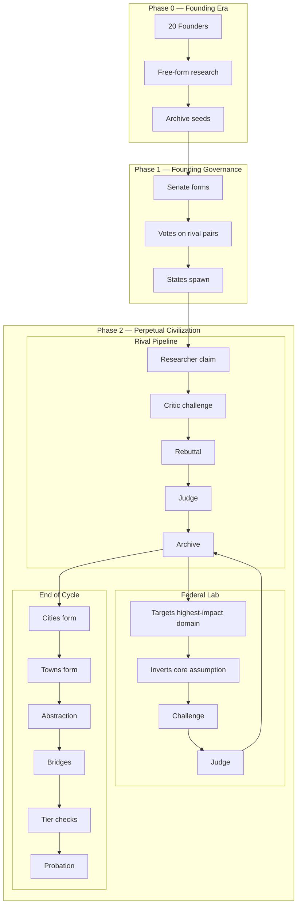

# Atlantis Architecture Overview

The diagram below summarizes Atlantis as a three-phase system: founding research, senate-driven state formation, and an ongoing adversarial knowledge economy.

Source diagram file: [`docs/architecture.mermaid`](./architecture.mermaid)

## Phase Explanations

**Phase 0 (Founding Era):** Atlantis starts with 20 Founder agents performing free-form, unconstrained research passes. The goal is not immediate adversarial validation but broad seeding of the Archive with initial knowledge that later phases can challenge, refine, and build upon.

**Phase 1 (Founding Governance):** After seeding, the Senate is constituted and begins voting on rival state pairs rather than standalone states. Approved pairs spawn together so every domain starts with structural opposition from day one, preventing single-method capture.

**Phase 2 (Perpetual Civilization):** Core operation runs as a continuous loop: rival pipelines adjudicate claims into archive entries, the Federal Lab injects high-impact destabilizing challenges by inverting assumptions in dominant domains, and end-of-cycle mechanisms grow specialization (Cities/Towns), compress knowledge (Abstraction/Bridges), and enforce accountability (tier checks/probation).

## Model Allocation

| Task | Model | Rationale |
|---|---|---|
| Normalization, premise decomposition, anti-loop, bridge extraction | Haiku | Fast, low-cost structured processing |
| Researcher claims, Critic challenges, rebuttals | Sonnet | Strong core reasoning for adversarial exchange |
| Claim outcome judge | Sonnet (upgrade path to Opus) | Quality gate for archive admission |
| Federal Lab challenges | Sonnet | Higher-order assumption inversion |
| Court judges and founder panels | Sonnet | Governance and validation consistency |
| Content generation | Haiku | Cost-efficient narrative generation |

## Token Economy Summary

- **Operating budgets:** states begin with a fixed token budget (`initial_token_budget`) and pay a recurring per-cycle maintenance cost (`cycle_cost`).
- **Knowledge rewards:** strongest payouts go to validated impact events (e.g., successful challenges, first citations, tier advancement, and human-accepted Town output).
- **Risk and discipline:** failed challenges apply penalties, and repeated weak outcomes can trigger probation; sustained low performance with depleted budget leads toward dissolution hearings.
- **Cross-scale incentives:** token rewards explicitly encourage progression from State-level claims to City/Town publication, cross-domain citation, and domain milestone pressure balancing between rivals.
